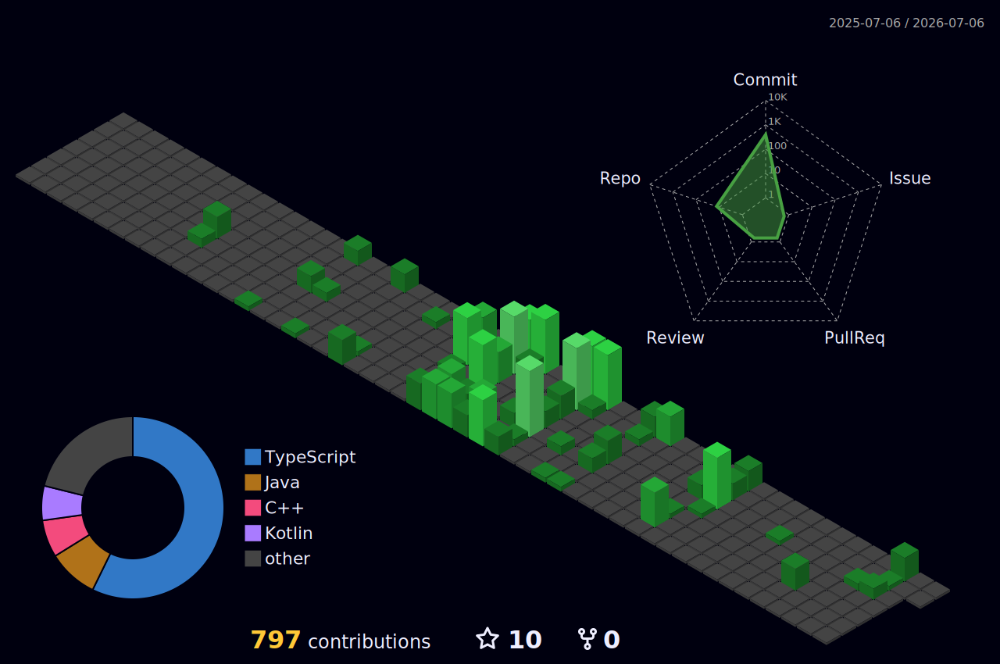

  <a href="https://github.com/codewithmahad/codewithmahad">
    <picture>
      <source media="(prefers-color-scheme: dark)" srcset="assets/dark.svg">
      <source media="(prefers-color-scheme: light)" srcset="assets/dark.svg">
      
    </picture>
  </a>

 

  

