  

 

  <a href="https://git.io/typing-svg">
    <picture>
      <source media="(prefers-color-scheme: light)" srcset="https://readme-typing-svg.herokuapp.com?font=JetBrains+Mono&weight=800&size=24&duration=2500&pause=1000&color=FFFFFF&background=151515&center=true&vCenter=true&width=800&height=70&cursor=_&lines=%3E_++Backend+Developer+(Student);%3E_++Java+%E2%80%A2+Spring+Boot+%E2%80%A2+REST+APIs;%3E_++Building+Structured+Services;%3E_++Problem+Solving+(DSA)..." />
      <source media="(prefers-color-scheme: dark)" srcset="https://readme-typing-svg.herokuapp.com?font=JetBrains+Mono&weight=800&size=24&duration=2500&pause=1000&color=FFFFFF&background=202020&center=true&vCenter=true&width=800&height=70&cursor=_&lines=%3E_++Backend+Developer+(Student);%3E_++Java+%E2%80%A2+Spring+Boot+%E2%80%A2+REST+APIs;%3E_++Building+Structured+Services;%3E_++Problem+Solving+(DSA)..." />
      
    </picture>
  </a>

 

  <picture>
    <source media="(prefers-color-scheme: light)" srcset="https://capsule-render.vercel.app/api?type=soft&color=E0E0E0&height=70&section=header&text=A%20B%20O%20U%20T%C2%A0%C2%A0%C2%A0M%20E&fontSize=25&fontColor=000000&animation=fadeIn&fontAlignY=55&font=Josefin+Sans" />
    <source media="(prefers-color-scheme: dark)" srcset="https://capsule-render.vercel.app/api?type=soft&color=0:000000%2C100:252525&height=70&section=header&text=A%20B%20O%20U%20T%C2%A0%C2%A0%C2%A0M%20E&fontSize=25&fontColor=C9C9C9&animation=fadeIn&fontAlignY=55&font=Josefin+Sans" />
    
  </picture>

  <table width="90%">
    <tr>
      <td align="left">
        I am a Software Engineering student at <b>UBIT (University of Karachi)</b>, focused on backend development with Java and Spring Boot.
          
        My work centers on building structured REST APIs, designing layered backend services, and strengthening core CS fundamentals — Data Structures & Algorithms, Object-Oriented Programming, and database systems.
          
        Previously explored Native Android development and now focus primarily on backend engineering with Java and Spring Boot.
          
        Founder of <b>The UBIT Hub</b> — a student community connecting 900+ UBIT students through academic discussion, course support, and peer learning.
      </td>
    </tr>
  </table>

 

  <picture>
    <source media="(prefers-color-scheme: light)" srcset="https://capsule-render.vercel.app/api?type=soft&color=E0E0E0&height=70&section=header&text=F%20E%20A%20T%20U%20R%20E%20D%C2%A0%C2%A0%C2%A0P%20R%20O%20J%20E%20C%20T%20S&fontSize=25&fontColor=000000&animation=fadeIn&fontAlignY=55&font=Josefin+Sans" />
    <source media="(prefers-color-scheme: dark)" srcset="https://capsule-render.vercel.app/api?type=soft&color=0:000000%2C100:252525&height=70&section=header&text=F%20E%20A%20T%20U%20R%20E%20D%C2%A0%C2%A0%C2%A0P%20R%20O%20J%20E%20C%20T%20S&fontSize=25&fontColor=C9C9C9&animation=fadeIn&fontAlignY=55&font=Josefin+Sans" />
    
  </picture>

  <table width="90%" style="border-collapse: collapse; border: none;">
    <tr>
      <td width="50%" align="center" style="border: 1px solid #333; padding: 24px; vertical-align: top;">
        <h3>🏋️ Fitness Tracker API</h3>
        
<i>A REST API implementing user authentication, role-based access control, and relational data management.</i>

        

          <code>JWT Authentication</code> &nbsp; <code>RBAC</code> 
          <code>Spring Security</code> &nbsp; <code>MapStruct</code> 
          <code>Pagination & Filtering</code> &nbsp; <code>Global Exception Handling</code>
        

        
<samp>Java · Spring Boot · PostgreSQL · REST</samp>

        
      </td>
      <td width="50%" align="center" style="border: 1px solid #333; padding: 24px; vertical-align: top;">
        <h3>⚙️ Spring Boot Architecture Template</h3>
        
<i>A reusable Spring Boot baseline with standardised layered architecture and automated DTO mapping.</i>

        

          <code>Layered Architecture</code> &nbsp; <code>Flyway Migrations</code> 
          <code>MapStruct DTO Mapping</code> &nbsp; <code>Clean Module Separation</code>
        

        
<samp>Spring Boot · Flyway · MapStruct</samp>

        
      </td>
    </tr>
  </table>

 

  <picture>
    <source media="(prefers-color-scheme: light)" srcset="https://capsule-render.vercel.app/api?type=soft&color=E0E0E0&height=70&section=header&text=E%20N%20G%20I%20N%20E%20E%20R%20I%20N%20G%C2%A0%C2%A0%C2%A0S%20T%20A%20C%20K&fontSize=25&fontColor=000000&animation=fadeIn&fontAlignY=55&font=Josefin+Sans" />
    <source media="(prefers-color-scheme: dark)" srcset="https://capsule-render.vercel.app/api?type=soft&color=0:000000%2C100:252525&height=70&section=header&text=E%20N%20G%20I%20N%20E%20E%20R%20I%20N%20G%C2%A0%C2%A0%C2%A0S%20T%20A%20C%20K&fontSize=25&fontColor=C9C9C9&animation=fadeIn&fontAlignY=55&font=Josefin+Sans" />
    
  </picture>

   
  <samp style="font-size: 14px; color: #888;">C O R E &nbsp; A R C H I T E C T U R E</samp>

 

  <table align="center" style="border: none;">
    <tr>
      <td align="center" width="96">
        <picture>
          <source media="(prefers-color-scheme: light)" srcset="https://raw.githubusercontent.com/devicons/devicon/master/icons/java/java-original.svg" />
          <source media="(prefers-color-scheme: dark)" srcset="./java-white.png" />
          
        </picture>
      </td>
      <td align="center" width="96">
        <picture>
          <source media="(prefers-color-scheme: light)" srcset="https://cdn.simpleicons.org/springboot" />
          <source media="(prefers-color-scheme: dark)" srcset="https://cdn.simpleicons.org/springboot/white" />
          
        </picture>
         Spring Boot
      </td>
      <td align="center" width="96">
        <picture>
          <source media="(prefers-color-scheme: light)" srcset="https://cdn.simpleicons.org/postgresql" />
          <source media="(prefers-color-scheme: dark)" srcset="https://cdn.simpleicons.org/postgresql/white" />
          
        </picture>
         PostgreSQL
      </td>
      <td align="center" width="96">
        <picture>
          <source media="(prefers-color-scheme: light)" srcset="https://cdn.simpleicons.org/flyway" />
          <source media="(prefers-color-scheme: dark)" srcset="https://cdn.simpleicons.org/flyway/white" />
          
        </picture>
         Flyway
      </td>
      <td align="center" width="96">
        <picture>
          <source media="(prefers-color-scheme: light)" srcset="https://cdn.simpleicons.org/springsecurity" />
          <source media="(prefers-color-scheme: dark)" srcset="https://cdn.simpleicons.org/springsecurity/white" />
          
        </picture>
         Security
      </td>
    </tr>
    <tr>
      <!-- Docker, Redis, MongoDB commented out — add back once used in projects
      <td align="center" width="96">
        <picture>
          <source media="(prefers-color-scheme: light)" srcset="https://cdn.simpleicons.org/docker" />
          <source media="(prefers-color-scheme: dark)" srcset="https://cdn.simpleicons.org/docker/white" />
          
        </picture>
         Docker
      </td>
      <td align="center" width="96">
        <picture>
          <source media="(prefers-color-scheme: light)" srcset="https://cdn.simpleicons.org/redis" />
          <source media="(prefers-color-scheme: dark)" srcset="https://cdn.simpleicons.org/redis/white" />
          
        </picture>
         Redis
      </td>
      <td align="center" width="96">
        <picture>
          <source media="(prefers-color-scheme: light)" srcset="https://cdn.simpleicons.org/mongodb" />
          <source media="(prefers-color-scheme: dark)" srcset="https://cdn.simpleicons.org/mongodb/white" />
          
        </picture>
         MongoDB
      </td>
      -->
      <td align="center" width="96">
        <picture>
          <source media="(prefers-color-scheme: light)" srcset="https://cdn.simpleicons.org/jsonwebtokens" />
          <source media="(prefers-color-scheme: dark)" srcset="https://cdn.simpleicons.org/jsonwebtokens/white" />
          
        </picture>
         JWT Auth
      </td>
      <td align="center" width="96">
        <picture>
          <source media="(prefers-color-scheme: light)" srcset="https://cdn.simpleicons.org/cplusplus" />
          <source media="(prefers-color-scheme: dark)" srcset="https://cdn.simpleicons.org/cplusplus/white" />
          
        </picture>
         C++ (DSA)
      </td>
    </tr>
  </table>

 

  <samp style="font-size: 14px; color: #888;">D E V &nbsp; T O O L K I T</samp>

 

  
  
  
  
  

 

 

<h3>T E C H N I C A L &nbsp; F O C U S</h3>

 

  <table align="center" style="border: none;">
    <tr>
      <td width="30">▪️</td>
      <td><b>Backend Architecture:</b> Building REST APIs with Spring Boot — Security, Validation, and layered service structure following clean architecture principles.</td>
    </tr>
    <tr>
      <td width="30">▪️</td>
      <td><b>Database Engineering:</b> Working with PostgreSQL — indexing, query design, schema modeling, and version-controlled migrations via Flyway.</td>
    </tr>
    <tr>
      <td width="30">▪️</td>
      <td><b>System Fundamentals:</b> Learning Java internals, OOP design patterns, and application performance fundamentals.</td>
    </tr>
    <tr>
      <td width="30">▪️</td>
      <td><b>Problem Solving:</b> Consistent DSA practice on LeetCode, Codeforces, and GeeksForGeeks using C++ to sharpen algorithmic thinking.</td>
    </tr>
  </table>

 

 

<h3>G I T H U B &nbsp; A C T I V I T Y</h3>

  <picture>
    <source media="(prefers-color-scheme: dark)" srcset="https://github-readme-stats.vercel.app/api?username=codewithmahad&show_icons=true&theme=transparent&hide_border=true&title_color=FFFFFF&text_color=888888&icon_color=FFFFFF&bg_color=00000000" />
    <source media="(prefers-color-scheme: light)" srcset="https://github-readme-stats.vercel.app/api?username=codewithmahad&show_icons=true&theme=transparent&hide_border=true&title_color=000000&text_color=555555&icon_color=000000&bg_color=00000000" />
    
  </picture>

 

  

 

  <picture>
    <source media="(prefers-color-scheme: dark)" srcset="https://raw.githubusercontent.com/mahad2006/mahad2006/main/profile-3d-contrib/profile-night-green.svg" />
    <source media="(prefers-color-scheme: light)" srcset="https://raw.githubusercontent.com/mahad2006/mahad2006/main/profile-3d-contrib/profile-night-green.svg" />
    
  </picture>

 

  <picture>
    <source media="(prefers-color-scheme: light)" srcset="https://capsule-render.vercel.app/api?type=soft&color=E0E0E0&height=70&section=header&text=D%20I%20G%20I%20T%20A%20L%C2%A0%C2%A0%C2%A0P%20R%20E%20S%20E%20N%20C%20E&fontSize=25&fontColor=000000&animation=fadeIn&fontAlignY=55&font=Josefin+Sans" />
    <source media="(prefers-color-scheme: dark)" srcset="https://capsule-render.vercel.app/api?type=soft&color=0:000000%2C100:252525&height=70&section=header&text=D%20I%20G%20I%20T%20A%20L%C2%A0%C2%A0%C2%A0P%20R%20E%20S%20E%20N%20C%20E&fontSize=25&fontColor=C9C9C9&animation=fadeIn&fontAlignY=55&font=Josefin+Sans" />
    
  </picture>

   
  
  
  
    
  
  
  
  

 

  <picture>
    <source media="(prefers-color-scheme: dark)" srcset="assets/terminal.svg">
    <source media="(prefers-color-scheme: light)" srcset="assets/terminal.svg">
    
  </picture>

 

<picture>
  <source media="(prefers-color-scheme: dark)" srcset="https://capsule-render.vercel.app/api?type=waving&color=B0B0B0&height=120&section=footer" />
  <source media="(prefers-color-scheme: light)" srcset="https://capsule-render.vercel.app/api?type=waving&color=B0B0B0&height=120&section=footer" />
  
</picture>
