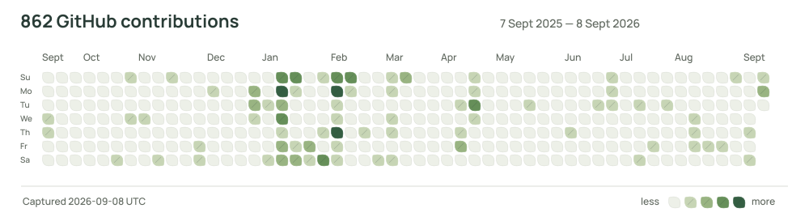
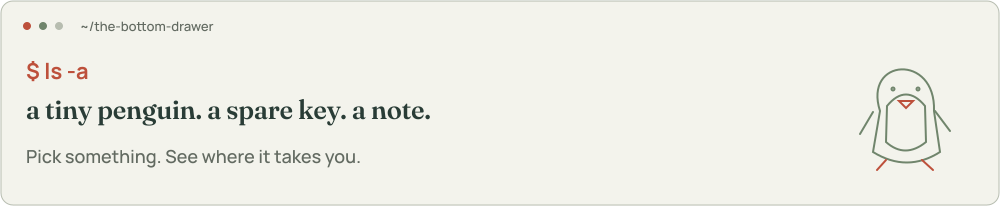

<!-- You found the source. The penguin insists this counts as code review. -->

<picture>
  <source media="(max-width: 600px) and (prefers-color-scheme: dark)" srcset="assets/profile/hero-mobile-dark.svg">
  <source media="(max-width: 600px)" srcset="assets/profile/hero-mobile-light.svg">
  <source media="(prefers-color-scheme: dark)" srcset="assets/profile/hero-dark.svg">
  
</picture>

**I’m Shaikh Mahad Ud Din**, a BS Software Engineering student at **UBIT, University of Karachi**.

I started with native Android apps. Now I’m working with **Java and Spring Boot**, learning how requests move through an application, how access is controlled, and how the data is stored. I want to understand the systems I build well enough to explain them, all the way down to the database.

<h2>Backend projects</h2>

### [Fitness Tracker API ↗︎](https://github.com/codewithmahad/fitness-tracker-backend)

A backend for workout data, with JWT authentication, user roles, and input validation. I’m using it to work through how the layers of a Spring Boot application fit together.

Java · Spring Boot · Spring Security · MySQL · MapStruct

### [Spring Boot Starter ↗︎](https://github.com/codewithmahad/spring-boot-25-enterprise-template)

A starting point for my next backend project: separated layers, Flyway migrations, DTO mapping, and API documentation. The setup I don’t want to repeat every time.

Java · Spring Boot · Flyway · MapStruct · OpenAPI

 

<h2>Learning notes</h2>

**[LINUX_LAB ↗︎](https://github.com/codewithmahad/LINUX_LAB)** started in my Operating Systems lab. I’m keeping it going because I want to understand the machine I’m writing code on.

Commands, permissions, processes, and Bash scripts—with notes on what made them click.

Other notebooks: **[Java](https://github.com/codewithmahad/JAVA_LAB)** · **[SQL](https://github.com/codewithmahad/SQL_LAB)** · **[Data structures & algorithms](https://github.com/codewithmahad/DSA_LAB)**

 

| Area | Tools I use |
| :--- | :--- |
| Backend | Java, Spring Boot, Spring Security, MapStruct |
| Data | PostgreSQL, MySQL, SQL, Flyway |
| Everyday tools | Git, Maven, Linux, Bash, Postman, IntelliJ IDEA |

I’m also working through Java internals, design patterns, database design, and query performance.

Earlier Android projects

I worked with **Kotlin and Jetpack Compose** before moving into backend development:

- **[Derivify](https://github.com/codewithmahad/Derivify-Calculus-Toolkit)** — a native Android toolkit for multivariable calculus.
- **[Quizzler](https://github.com/codewithmahad/Quizzler-App)** — my second-semester OOP quiz app.

<h2>The UBIT Hub</h2>

I founded **The UBIT Hub**, a community connecting **900+ UBIT students** through course support, academic discussion, and peer learning.

Good notes shouldn’t disappear into an old group chat after finals. **[Our shared resources](https://github.com/codewithmahad/the-ubit-hub-resources)** collect notes, assignments, and lab material for the next student.

I also built the **[UBIT Semester Results Dashboard](https://github.com/codewithmahad/ubit-semester-result-dashboard)**, with GPA calculations, rankings, and PDF exports using Next.js and TypeScript.

 

GitHub activity

<a href="https://github.com/codewithmahad?tab=overview">
  <picture>
    <source media="(max-width: 600px) and (prefers-color-scheme: dark)" srcset="assets/profile/garden-mobile-dark.svg">
    <source media="(max-width: 600px)" srcset="assets/profile/garden-mobile-light.svg">
    <source media="(prefers-color-scheme: dark)" srcset="assets/profile/garden-dark.svg">
    
  </picture>
</a>

<h2>Say hello</h2>

Learning something similar or have a question about a repo? I’d be happy to compare notes.

**[Email](mailto:codewithmahad@gmail.com)** · **[LinkedIn](https://www.linkedin.com/in/codewithmahad)** · **[Portfolio](https://shaikhmahad.vercel.app)**

 

Where I practise **C++ and DSA**: [LeetCode](https://leetcode.com/u/mahad2006/) · [HackerRank](https://www.hackerrank.com/codewithmahad) · [GeeksforGeeks](https://www.geeksforgeeks.org/user/codewithmahad/) · [Codolio](https://codolio.com/profile/codewithmahad).

Psst. There’s one more drawer.

 

<picture>
  <source media="(max-width: 600px) and (prefers-color-scheme: dark)" srcset="assets/profile/drawer-mobile-dark.svg">
  <source media="(max-width: 600px)" srcset="assets/profile/drawer-mobile-light.svg">
  <source media="(prefers-color-scheme: dark)" srcset="assets/profile/drawer-dark.svg">
  
</picture>

**[Follow the penguin →](https://github.com/codewithmahad/LINUX_LAB)** a Linux rabbit hole. 
**[Take the spare key →](https://github.com/codewithmahad/spring-security-jwt-mastery)** a look at authentication. 
**[Pass the note →](https://github.com/codewithmahad/the-ubit-hub-resources)** something useful for the next student.

<!-- Bonus drawer: thanks for reading the small print. See you in the commit history. -->

<h2>Copyright & permissions</h2>

**© 2026 Shaikh Mahad Ud Din. All rights reserved.**

Please ask before reusing my README text, artwork, or original layout. Reposting, adapting, or using protected material in another profile or template requires my written permission; credit alone isn’t permission.

**[Read the full terms](LICENSE.md)** · **[Request permission](mailto:codewithmahad@gmail.com?subject=Profile%20reuse%20permission)**

Subject to applicable law, GitHub’s platform rights, and third-party licenses. See the full terms for scope and exceptions.

 

<a href="#top">Back to the desk ↑</a>

