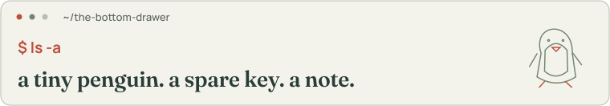

<!-- You found the source. The penguin insists this counts as code review. -->

  <picture>
    <source media="(prefers-color-scheme: dark)" srcset="assets/profile/masthead-dark.svg">
    
  </picture>

**I’m Shaikh Mahad Ud Din**, a developer from Karachi, Pakistan, focused on **Java and Spring Boot**.

I started with native Android apps in Kotlin and Jetpack Compose. Building screens got me interested in the part I couldn’t see: how an application decides who can do what, where its data belongs, and what happens when a request goes wrong.

That curiosity is what brought me to backend development. I build Spring Boot APIs, work with relational databases, and keep pulling apart the pieces until I can explain how they fit. I want to follow a request from the controller to the database and understand the service logic, security rules, and queries along the way.

A little more about my path

**BS Software Engineering at UBIT, University of Karachi** brought programming, databases, and operating systems into the same picture for me. My repositories give me somewhere to keep working through them.

The Android chapter is still here:

- **[Derivify](https://github.com/codewithmahad/Derivify-Calculus-Toolkit)**: a native Android toolkit for multivariable calculus, built with Kotlin and Jetpack Compose.
- **[Quizzler](https://github.com/codewithmahad/Quizzler-App)**: the quiz app I built for my second-semester OOP project.

I also founded **The UBIT Hub**. Sharing notes and building small tools for that community is another reason I keep making things.

What I use, and what I’m working on

   &nbsp;<strong>Java</strong> 
  My main language for backend work. I’m going deeper into Java internals, object-oriented design, and the patterns that make code easier to change.

   &nbsp;<strong>Spring Boot & Spring Security</strong> 
  APIs, authentication, access control, and application layers. MapStruct handles DTO mapping in my backend projects.

   &nbsp;<strong>Databases</strong> 
  PostgreSQL, MySQL, SQL, and Flyway. I’m working on schema design, migrations, and understanding the queries an application depends on.

   &nbsp;<strong>Everyday tools</strong> 
  Git for version control, Maven for builds, Linux and Bash for the environment, Postman for API requests, and IntelliJ IDEA for development.

Alongside project work, I practise **DSA** and work through design patterns and query performance. The aim is to understand the tools well enough to explain the choices I make.

  

<h2>Backend projects</h2>

  <a href="https://github.com/codewithmahad/fitness-tracker-backend"><strong>Fitness Tracker API ↗︎</strong></a> 
  A MySQL-backed workout API with JWT authentication, user roles, and input validation. This is where I’m putting the layers of a Spring Boot backend together.

  <a href="https://github.com/codewithmahad/spring-boot-25-enterprise-template"><strong>Spring Boot Starter ↗︎</strong></a> 
  A reusable starting point with separated layers, database migrations, and API documentation. The setup I don’t want to repeat for every new idea.

Inside these projects

**Fitness Tracker:** Java, Spring Boot, Spring Security, MySQL, and MapStruct. The project brings workout data, authentication, role-based access, validation, and DTO mapping into one application.

**Spring Boot Starter:** Java, Spring Boot, Flyway, MapStruct, and OpenAPI. It brings together the project structure, migration setup, mapping, and documentation I want ready before starting the next backend.

**What I’m paying attention to:** where controller, service, and repository responsibilities meet; what data crosses those boundaries; and how access and validation rules fit into the request flow.

Each repository has its own setup instructions and implementation details.

<h2 id="the-notebook-stays-open">Learning notes</h2>

  <a href="https://github.com/codewithmahad/LINUX_LAB"><strong>LINUX_LAB ↗︎</strong></a> started in my Operating Systems lab. It’s where I work through commands, permissions, processes, and Bash scripts and write the explanation I wish I’d had when something didn’t make sense.
   

  Other notebooks:
  <a href="https://github.com/codewithmahad/JAVA_LAB"><strong>Java</strong></a> ·
  <a href="https://github.com/codewithmahad/SQL_LAB"><strong>SQL</strong></a> ·
  <a href="https://github.com/codewithmahad/DSA_LAB"><strong>Data structures & algorithms</strong></a>

<h2 id="some-things-are-better-shared">The UBIT Hub</h2>

I founded **The UBIT Hub**, a community connecting **900+ UBIT students** through course support, academic discussion, and peer learning.

Good notes shouldn’t disappear into an old group chat after finals. **[Our shared resources](https://github.com/codewithmahad/the-ubit-hub-resources)** collect notes, assignments, and lab material for the next person who needs them.

The resources and tools behind the community

The resource repository gives course material a place people can return to. It’s the same reason I keep my own learning notes: something that took time to understand should be easier for the next person to find.

I also built the **[UBIT Semester Results Dashboard](https://github.com/codewithmahad/ubit-semester-result-dashboard)** using **Next.js and TypeScript**, with GPA calculations, rankings, and PDF exports.

These projects connect the two parts of my GitHub: learning how things work, and making something useful with what I learn.

  <picture>
    <source media="(prefers-color-scheme: dark)" srcset="assets/profile/contact-heading-dark.svg">
    
  </picture>

This profile changes as I build. You’ll find backend projects, Linux notes, and tools for The UBIT Hub here. [Follow me on GitHub](https://github.com/codewithmahad) if you’d like to see what comes next.

If a repo helped you, left you with a question, or sparked an idea, I’d like to hear about it. I go by **codewithmahad** on most platforms.

  <a href="https://www.linkedin.com/in/codewithmahad"><picture><source media="(prefers-color-scheme: dark)" srcset="assets/profile/contact/linkedin-dark.svg"></picture></a>
  <a href="https://shaikhmahad.vercel.app"><picture><source media="(prefers-color-scheme: dark)" srcset="assets/profile/contact/portfolio-dark.svg"></picture></a>
  <a href="mailto:codewithmahad@gmail.com"><picture><source media="(prefers-color-scheme: dark)" srcset="assets/profile/contact/email-dark.svg"></picture></a>

Coding profiles & practice

  <a href="https://leetcode.com/u/mahad2006/">&nbsp;LeetCode</a> &nbsp;&nbsp;
  <a href="https://www.hackerrank.com/codewithmahad"><picture><source media="(prefers-color-scheme: dark)" srcset="assets/profile/practice/hackerrank-wordmark-dark.svg"></picture></a> &nbsp;&nbsp;
  <a href="https://www.geeksforgeeks.org/user/codewithmahad/">&nbsp;GeeksforGeeks</a> &nbsp;&nbsp;
  <a href="https://codolio.com/profile/codewithmahad">&nbsp;Codolio</a>

Psst. There’s one more drawer.

<picture>
  <source media="(prefers-color-scheme: dark)" srcset="assets/profile/drawer-compact-dark.svg">
  
</picture>

  <a href="https://github.com/codewithmahad/LINUX_LAB"><strong>Follow the penguin →</strong></a> a Linux rabbit hole. 
  <a href="https://github.com/codewithmahad/spring-security-jwt-mastery"><strong>Take the spare key →</strong></a> a look at authentication. 
  <a href="https://github.com/codewithmahad/the-ubit-hub-resources"><strong>Pass the note →</strong></a> something useful for the next student.

<!-- Bonus drawer: thanks for reading the small print. See you in the commit history. -->

<h3 id="a-keyboard-habit">From 60 to 120+ WPM</h3>

I started learning **touch typing in 2023** so I could keep my eyes on the screen and stop searching for keys. It helps with code, notes, and everyday messages. If typing still slows you down, [try a short test on Monkeytype](https://monkeytype.com/) and give yourself a starting point.

My personal bests and what helped

I was around **60 WPM** when I started, before joining Monkeytype. Reaching **120+ WPM** came gradually with practice. A few recorded bests from [my profile](https://monkeytype.com/profile/CodeWithMahad1):

| Test | WPM | Accuracy |
| :--- | ---: | ---: |
| 15 seconds | **156** | 100% |
| 30 seconds | **144** | 96% |
| 60 seconds | **133** | 96% |
| 120 seconds | **117** | 94% |

What I notice day to day is fewer interruptions: I can keep my attention on a command, a sentence, or the problem I’m working through. That’s useful whether you write code, lecture notes, or emails.

Start with a short test, work on accuracy, and come back for a few minutes regularly. Keep your first score. It’s satisfying to look back at it later.

© 2026 Shaikh Mahad Ud Din · All rights reserved · <a href="LICENSE.md">Copyright</a> <a href="#top">Back to the desk ↑</a>

